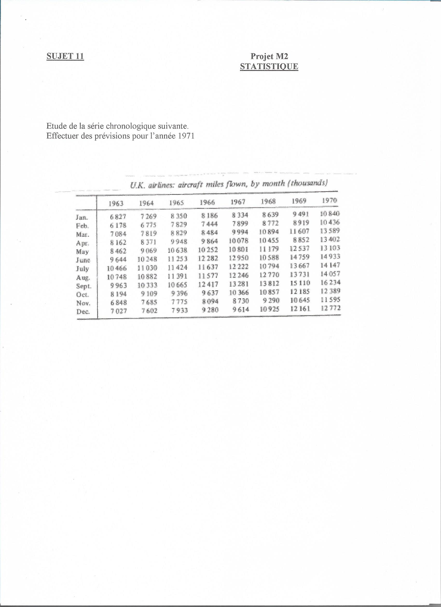

```{r eval=FALSE, include=FALSE}
#install.packages("sjPlot")
#install.packages("visreg")

library(visreg)
# https://cran.r-project.org/web//packages/visreg/visreg.pdf
library(sjPlot)
# https://strengejacke.github.io/sjPlot/articles/tab_model_estimates.html
library(directlabels)
# https://tdhock.github.io/directlabels/

library(knitr)
library(tidyverse)
library(stargazer)

## https://towardsdatascience.com/statistical-test-for-time-series-a57d9155d09b
```


```{r setup, include=FALSE}
knitr::opts_chunk$set(echo = FALSE)
library(stargazer)
library(dplyr)
#library(astsa)
library(changepoint)
#library(caschrono)
library(tseries)
library(forecast)
library(lmtest)

setwd("/home/matthias/Documents/Wien/Statistik/Erasmus/cours/serieschrono/projet/")
```

# Les bases

Dans ce projet il faut effectuer un analysis des données reçues, et faire une prévision pour l'année 1971.
Nous allons utiliser R avec les packages `tseries` et `forecast`.

Premièrement, une analyse rudimentaire des données et de leurs propriétés.


```{r import, results="asis"}
donnees <- read.csv("donnees.csv", stringsAsFactors=FALSE)
donnees$date = as.Date(donnees$date, "%d/%m/%Y")
miles = ts(donnees$miles, start=as.double(format.Date(donnees$date[1], "%Y")), frequency=12)
```

Les données sont affichées ci-dessous. C'est bien évident qu'il ne s'agit pas d'une séries stationnaire, car il y a une tendance.
Denommons les miles par moi avec la suite $(X_t)$.

```{r representation graphique de la serie temporelle}
plot(donnees, type="l", main = "U.K. airlines: aircraft miles flown, by months (thousands)")
#plot(donnees$date, log(donnees$miles), type = "l")
```
Mais il semble aussi qu'il ait une croissance exponentielle. Cela ne surprend pas avec une scale non-négative.
Pour comparison: La variance de la première moitié est `r var(head(miles,length(miles)/2))`, la seconde moitié `r var(tail(miles,length(miles)/2))`.
Afin de reducer cette propriété nous prenons le logarithme népérien (variances: `r var(head(log(miles),length(miles)/2))` et `r var(tail(log(miles),length(miles)/2))`).

```{r}
plot(donnees$date, log(miles), type= "l")
```


```{r}
dw = dwtest(log(miles) ~ date, data = donnees)
```
On a fait un Durbin-Watson Test: $H_0$ afin de savoir si l'autocorrelation des erreurs estimées d'un modèle linéare `log(miles) ~ date` est égal à 0, qui est rejetée avec une valeur p de `r dw$p.value`. 
Clairement on rejète $H_0$.
Il y aura sûrement des autres assumptions blessées pour faire un GLM, par exemple l'égalité des variances et l'indépandence des valeurs et des erreurs.

```{r}
# tsdisplay(miles, ci.type = "ma", main = "X_t = miles") # faut-il "ma" ici? C'est pas dans le diaporama
```
### La tendance

En gros, on a deux possibilités pour supprimer la tendance.
Soit avec un modèl additif:

```{r eval=FALSE, include=FALSE}
#m = decompose(log(miles), type = "additive")
#plot(m)
# plot(decompose(miles, type = "multiplicative"))
```
```{r tendance linéare additive}
fit.add = lm(log(miles) ~ date, data = donnees)
plot(donnees$date, log(miles), type = "l")
abline(fit.add, col = "red")
plot(fit.add$residuals, type = "l")
```

Soit en différencier:
$$Z_t = log(X_t) - log(X_{t-1}) = (1-B)\log(X_t)$$
```{r delta}
mdiff1 = diff(log(miles),lag = 1, difference = 1) #12

x = tail(donnees$date, length(mdiff1))
fit.1 = lm(mdiff1 ~ x)
plot(x, mdiff1, type = "l")
abline(fit.1, col = "red")
plot(fit.1$residuals, type = "l")

```

Laquelle mèthode choisir ? Généralment différencier est mieux.

```{r}
par(mfcol=c(4,1),mar=c(2,3,0.5,5),pch=20)

acf(fit.add$residuals); mtext("  add.",4,las=1)
pacf(fit.add$residuals)
acf(fit.1$residuals); mtext("  mult.",4,las=1)
pacf(fit.1$residuals)
```


```{r periodogramm}
periodogramm <- function(z){
  
# Abbildung 3
par(mfcol=c(3,1),mar=c(2,2,0.5,2),pch=20)
h <- 2*pi
H <- spec.pgram(z, taper=0,detrend=FALSE,fast=FALSE,plot=FALSE)
plot(h*H$freq,H$spec/h,type="l")
mtext(" (a)",4,las=1)

# tendance
t = tail(donnees$date,length(z))
H <- spec.pgram(lm(z ~ t)$residuals,taper=0,detrend=FALSE,fast=FALSE,plot=FALSE)
plot(h*H$freq,H$spec/h,type="l")
mtext(" (c)",4,las=1)

plot(log(h*H$freq[1:20]),log(H$spec[1:20]/h),type="o",lwd=2)  
mtext(" (e)",4,las=1) 

for (c in (-15):(15)) abline(a=c,b=-1,col="gray")
}

#periodogramm(mdiff12diff1)
periodogramm(miles)
```


C'est déja mieux, les erreurs semblent plus stable, mais pourtant il existe une autocorrélation.

```{r}
periodogramm(mdiff1)
```

Pour les données différenciées il n'y a pas une courbe raide vers le zéro (voir a, fréquence de Fourier $\omega_k = \frac{2\pi k}{n}$)).
En outre, le log-périodogrammes des résidus tombe moins vite pour les résidus des données différenciées (voir e) qu'implique des résidues stationnairs.

Steigt die Spektraldichte $f(\omeag)$ mindestens so steil an wie $h(\omega ) = c\omega^{-1}$ , dann ist sie nicht integrierbar, was unvereinbar ist mit Stationarität, weil die Varianz eines stationären Prozesses gegeben ist durch das Integral der Spektraldichte. In der Praxis ist $f$ unbekannt und muss durch einen Proxy ersetzt werden, z.B. durch das Periodogramm $I$. Für eine graphische Einschätzung der Stationarität kann man $I(\omega)$ gegen $\omega$ plotten und mit $h(\omega ) = c\omega^{-1}$ vergleichen. Einfacher ist es aber, wenn man $\log(I(\omega))$ gegen $\log(\omega)$ plottet und mit Geraden der Steigung -1 vergleicht (siehe Abbildung 3).

Les $\epsilon$ pour les deux modèls semblent stationnaire:

```{r delta 2.0}
adf.test(fit.1$residuals, k=0)
adf.test(fit.1$residuals, k=1)
adf.test(fit.1$residuals, k=2)
adf.test(fit.1$residuals, k=3)
adf.test(fit.1$residuals, k=4)
adf.test(fit.1$residuals, k=5)


adf.test(fit.add$residuals, k=0)
adf.test(fit.add$residuals, k=1)
adf.test(fit.add$residuals, k=2)
adf.test(fit.add$residuals, k=3)
adf.test(fit.add$residuals, k=4)
adf.test(fit.add$residuals, k=5)
```


### Delta12

Qu'est-ce qu'il faut faire pour que la série soit stationnaire ?

```{r delta^2}
mdiff12diff1 = diff(mdiff1, lag=12)
tsdisplay(mdiff12diff1, ci.type = "ma", main = "(1-B)(1-B^12)X_t")

plot(mdiff12diff1)
fit.12.1 <- lm(mdiff12diff1 ~ tail(donnees$date,83))
abline(fit.12.1, col="red")
summary(fit.12.1)

```

We can use the Augmented Dickey-Fuller (ADF) t-statistic test to do this. ADF test is a test to check whether the series has a unit root or not. If it exists, the series has a linear trend. However, if it’s not, we can say that the model is stationary.

```{r test pour station.}
adf.test(mdiff12diff1)
```


Après differencier il faut tester s'il reste qu'un bruit blanc.

```{r fitting a model}
model1 <- arima(miles, order = c(0,1,1), seasonal=list(order = c(0,1,1), perdiod=12))

summary(model1)
```
### densité spectrale


# Abbildung 4
dx <- x[2:n]-x[1:(n-1)]; dy <- y[2:n]-y[1:(n-1)]
par(mfcol=c(3,2),mar=c(2,2,0.5,2),pch=20); h <- 2*pi
plot(T[2:n],dx,type="l"); mtext(" (a)",4,las=1)
H <- spec.pgram(dx,taper=0,detrend=FALSE,fast=FALSE,plot=FALSE)
plot(h*H$freq,H$spec/h,type="l"); mtext(" (c)",4,las=1)
HH <- spec.pgram(dx,taper=0,detrend=FALSE,fast=FALSE,plot=FALSE,spans=15)
lines(h*HH$freq,HH$spec/h,col="blue",lwd=2)
plot(h*H$freq,H$spec/h,type="l"); mtext(" (e)",4,las=1)
HH <- spec.pgram(dx,taper=0,detrend=FALSE,fast=FALSE,plot=FALSE,spans=25)
lines(h*HH$freq,HH$spec/h,col="blue",lwd=2)
plot(T[2:n],dy,type="l"); mtext(" (b)",4,las=1)
H <- spec.pgram(dy,taper=0,detrend=FALSE,fast=FALSE,plot=FALSE)
plot(h*H$freq,H$spec/h,type="l"); mtext(" (d)",4,las=1)
HH <- spec.pgram(dy,taper=0,detrend=FALSE,fast=FALSE,plot=FALSE,spans=15)
lines(h*HH$freq,HH$spec/h,col="red",lwd=2)
plot(h*H$freq,H$spec/h,type="l"); mtext(" (f)",4,las=1)
HH <- spec.pgram(dy,taper=0,detrend=FALSE,fast=FALSE,plot=FALSE,spans=25)
lines(h*HH$freq,HH$spec/h,col="red",lwd=2)
```


```{r forecast}
fvalues <- forecast(model1, 12)
# = fvalues2 <- predict(model1, 12)
print(fvalues)
plot(fvalues, col.main = "red")
```

```{r model diagnostics}
tsdiag(model1)

# il manque un t-test ? Donc:
coeftest(model1) #https://stackoverflow.com/questions/43826952/how-can-i-get-the-t-statistics-for-the-results-of-an-ar1-model-in-r

# portmanteau tests
Box.test(mdiff12diff1)
Box.test(residuals(model1), type = "Ljung-Box")


acf(residuals(model1), ci.type="ma")
pacf(residuals(model1), ci.type="ma" ,main="corrélogramme partiel de residuals(model1)")
```

