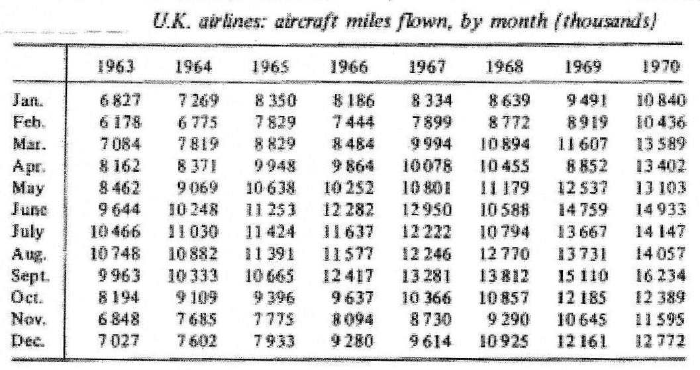

***

## Synthèse du présent rapport

On a obtenu comme base de données les distances volées par une compagnie aérienne brittanique. Les données sont par mois pour la période 1963 - 1970.
On vise à trouver un modèle pour décrire cette série temporaire et prévoir l'année 1971.

Pour y arriver, on les a premièrement transformées avec un $\log$, différenciées et de-saisonnalisées.
Puis, on a cherché des bons modèles avec plusieurs mèthodes: 

* un méthode itératif en interpretant les graphiques des ACF et PACF et puis en examiner si les résidus sont un bruit blanc, 
* en entraînant quelques modèles avec les années 1963 - 1969 on a comparé les prévisions pour l'année 1970 avec les valeurs vraies
* le méthode de coins
* en utilisant la fonction ` auto.arima`
* en comparant leurs AICs

On a trouvé plusieurs modèles validés.
À l'aide de l'AIC on a finalement choisi un $\text{SARIMA}_{12}((0,1,2)(0,1,1))$, avec lequelle on fait la prévision pour l'année 1971.
On l'a également interprété.

***

```{r setup, include=FALSE}

# https://www.imo.universite-paris-saclay.fr/~goude/Materials/time_series/cours5_ARMA.pdf
# https://developpaper.com/arma-arima-box-jenkins-sarima-and-arimax-models-in-r-language-are-used-to-predict-time-series-data/
# https://developpaper.com/arma-arima-box-jenkins-sarima-and-arimax-models-in-r-language-are-used-to-predict-time-series-data/
# https://towardsdatascience.com/statistical-test-for-time-series-a57d9155d09b
# https://autobox.com/pdfs/ARIMA%20FLOW%20CHART.pdf
# https://www.youtube.com/watch?v=N2AVuGV-eQk

knitr::opts_chunk$set(echo = FALSE)
library(latex2exp) # pour "TeX("$\\alpha$")
library(stargazer)
library(dplyr)
library(astsa) # https://github.com/nickpoison/astsa/blob/master/fun_with_astsa/fun_with_astsa.md
library(changepoint)
#library(caschrono) -> pas possible, dépendance de r-foreign -> R 3.6
library(tseries)
library(forecast)
library(lmtest)

wd <- "/home/matthias/Documents/Wien/Statistik/Erasmus/cours/serieschrono/projet/"
setwd(wd)
```

## 1 - Les bases

Dans ce projet il faut effectuer une analyse des données reçues, et faire une prévision pour l'année 1971.
Nous allons utiliser R avec les packages `tseries`, `astsa`,`forecast` et `lmtest`.

Premièrement, il suit une analyse rudimentaire des données et de leurs propriétés.


```{r import, include=FALSE}
donnees <- read.csv("donnees.csv", stringsAsFactors=FALSE)
donnees$date = as.Date(donnees$date, "%d/%m/%Y")
miles = ts(donnees$miles, 
           start=as.double(format.Date(donnees$date[1], "%Y")), 
           frequency=12)
```

Les données sont affichées ci-dessous. C'est bien évident qu'il ne s'agit pas d'une séries stationnaire, car il y a une tendance.
Dénommons les miles par mois avec la suite $(X_t)$.

```{r representation graphique de la serie temporelle}
plot(donnees, type="l", main = "U.K. airlines: aircraft miles flown, by months (thousands)")
#plot(donnees$date, log(donnees$miles), type = "l")
```
L'examen du graphique montre une tendance croissante, il paraît peut-être même une croissance exponentielle.
Le dernier cas a lieu si la variance croit avec la tendance.
C'est vraisemblable qu'il a aussi une saisonnalité annuelle, c'est à dire de période 12 car les données sont mensuelles.

#### Transformation

Mais il semble aussi qu'il ait une croissance exponentielle. Cela ne surprend pas avec une échelle non-négative.
Pour comparison: La variance de la première moitié est $`r round(var(head(miles,length(miles)/2)), -5)`$, la seconde moitié $`r round(var(tail(miles,length(miles)/2)), -5)`$.

On répartit les données , dont on dispose de `r length(miles)`, dans 6 groupes.
Leurs étendues en fonction de leur moyenne sont affichées ci-dessous pour les données originales et pour quelques transformations.

```{r transformation de Box et Cox}
#classes d'effectif par colonne
BoxCox_diag = function(d, main){
  eff = matrix(d, nrow=length(d)/6, ncol=6)
  lambdas = cbind(colMeans(eff), 1:6)
  
  for (i in 1:6){
    lambdas[i, 2] = diff(range(eff[,i]))
  }
  
  plot(lambdas, xlim=c(0, max(lambdas)), ylim=c(0, max(lambdas)),
       xlab = "moyenne",
       ylab = "étendue",
       main = main)
  lines(c(0,15000),c(0,15000), col="grey")
  # > proche de l'axe horizontale => il y a rien à faire, série stationnaire
  # > inférieur de x=y => estimer lambda >1

  # > BoxCox(miles, lambda = "auto")
}
par(mfrow=c(2,2))
d = donnees$miles
BoxCox_diag(d, main = TeX("l'étendue en fonction \n de moyenne de $X_t$"))
d = BoxCox(miles, lambda = "auto")
BoxCox_diag(d, main = "après transformation de \n Box et Cox")
#d = diff(diff(donnees$miles,12))[-(1:5)]
#BoxCox_diag(d, main = TeX("$(1-B)(1-B^{12})X_t$"))
d = log(miles)
BoxCox_diag(d, main = TeX("$\\log X_t$"))
```
Les points de la série orignale, en haut à la gauche, se trouvent un peu loin sous la diagonale, et ils sont d'un coup aussi déjà proche de l'axe.
Le meilleur sera soit une transformation de Box et Cox, soit qu'on affirme qu'ils sont déjà stationnaire.
On trouve pour le transformation de Box et Cox un $lambda=$$`r round( forecast::BoxCox.lambda(miles), 3)`$, afin de faire une transformation en forme de $\frac{X_t^{\lambda} -1}{\lambda}$.
Pour comparaison, les données originales et les transformation sont plotées ci-dessous, standarisées.
On voit que la transformation de Box et Cox baisse la variance pour l'année 1971, et augmente la variance pour la première année. Mais il n'y a pas une grande différence par rapport à $\\log(X_t)$.
Afin de reducer cette propriété nous prenons le logarithme népérien (variances: $`r round(var(head(log(miles),length(miles)/2)), 3)`$ et $`r round(var(tail(log(miles),length(miles)/2)), 3)`$).

```{r echo=FALSE}
plot((BoxCox(miles, lambda = "auto")-mean(BoxCox(miles, lambda = "auto")))/sd(BoxCox(miles, lambda = "auto")), col = "blue", 
     type= "p",
     ylab = "données centralisées",
     main = "les transformations (standardisées)")
points((log(miles)-mean(log(miles)))/sd(log(miles)), col = "green")
points((miles-mean(miles))/sd(miles), type="l", col="red")

legend("topleft",
       legend = c(
         TeX("séries $X_t$"),
         TeX("$\\log(X_t)$"),
         TeX("$\\frac{X_t^{\\lambda} -1}{\\lambda}$")),
       col = c("red","blue","green"),
       lty = 1,
       lwd = 2,
       cex = 0.7,
       text.col = "slategray4",
       #title = "Années",
       border = "white")
```


Mais comme vu, le logharithme népérien fait aussi en sorte que les variances soient égales, même si Box et Cox serait mieux.
On va l'utiliser pour sa simplicité dans la suite, puisque on peut facilement re-transformer les prévisions avec $e^{X_t}$.

On voit que les données $\log(X_t)$ déja stationnaires:
```{r, echo = TRUE}
adf.test(log(donnees$miles), alternative = "stationary", k=0) #k=0 <=> standard dick-fuller test
```

Du coup, on va utiliser les données transformées comme affichées:
```{r logX, echo=FALSE}
plot(donnees$date, log(miles), type= "l",
     xlab = "date",
     ylab = TeX("$\\log(X_t)$"),
     main = TeX("$\\log(X_t)$"))
```


```{r}
dw = dwtest(log(miles) ~ date, 
            data = donnees)$p.value
```
On a fait un Durbin-Watson Testafin de savoir si l'autocorrélation des erreurs estimées d'un modèle linéare `log(miles) ~ date` est égal à 0, qui est rejetée carrément avec une valeur p de $`r round(dw, 5)`$. 
Il y aura sûrement des autres assumptions blessées pour faire un GLM, par exemple l'égalité des variances et l'indépandence des valeurs et des erreurs.
On va alors essayer de les modèliser et faire une prévision avec un modèle AR, MA, SAM, SAR, ARIMA ou SARIMA.

### La tendance

En gros, on a deux possibilités pour supprimer la tendance et faire en sorte que $\mathbb{E}[X_t] = 0$, soustraire une tendance ou différencier d'un ordre quelquonque.

##### traiter la tendance de manière additive

Soit un modèl additif, dans lequel on modéliser plusieurs componants lesquelles, en somme, sont la série d'origine :

```{r echo=FALSE}
m = decompose(log(miles), type = "additive")
plot(m)
# plot(decompose(miles, type = "multiplicative")) -> I think multiplicative is more fitting, as the lag and seasonality for the non-log at least are increasing with time
```
```{r tendance linéare additive 1, include=FALSE}
fit.add = lm(log(miles) ~ date, data = donnees)

par(mfrow=c(1,2))
plot(donnees$date, log(miles), 
     ylab = TeX("$\\log(X_t)$"),
     xlab = "date",
     type = "l")
abline(fit.add, col = "red")

legend("bottomright",
       legend=c("Série observée",
                "Régression"), 
       col = c("black",
               "red"),
       lty = 1,
       lwd = 2,
       cex = 0.7,
       text.col = "slategray4",
       #title = "Années",
       border = "white")

# legend(legend="regression",
#        x=-2,y=8.85,xjust=1,bty="n",
#        fill = "red")

plot(fit.add$residuals,
     xlab = "date",
     type = "l")
```
```{r tendance linéare additive 2, eval=FALSE, include=FALSE}
fit.add = lm(log(miles) ~ date, data = donnees)
fit  = lm(miles ~ date, data = donnees)
par(mfrow=c(1,2))

plot(donnees$date, miles, 
     ylab = TeX("$(X_t)$"),
     xlab = "date",
     type = "l")
abline(fit, col = "red")

plot(donnees$date, log(miles), 
     ylab = TeX("$\\log(X_t)$"),
     xlab = "date",
     type = "l")
abline(fit.add, col = "red")

legend("bottomright",
       legend=c("Série observée",
                "Régression"), 
       col = c("black",
               "red"),
       lty = 1,
       lwd = 2,
       cex = 0.7,
       text.col = "slategray4",
       #title = "Années",
       border = "white")
```
```{r tendance linéare additive}
fit.add = lm(log(miles) ~ date, data = donnees)

par(mfrow=c(1,2))

plot(donnees$date, log(miles), 
     ylab = TeX("$\\log(X_t)$"),
     xlab = "date",
     type = "l")
abline(fit.add, col = "red")

legend("bottomright",
       legend=c("Série observée",
                "Régression"), 
       col = c("black",
               "red"),
       lty = 1,
       lwd = 2,
       cex = 0.7,
       text.col = "slategray4",
       #title = "Années",
       border = "white")

# legend(legend="regression",
#        x=-2,y=8.85,xjust=1,bty="n",
#        fill = "red")

plot(fit.add$residuals,
     xlab = "date",
     ylab = TeX("$\\epsilon = \\log(X_t)-(\\beta_0+date*\\beta)$"),
     type = "l")
```

Ici un problème se présente:
```{r echo=FALSE}
par(mar = c(3,4,4,2))
acf(fit.add$residuals, lag.max = 90)
```
L'autocorrélation ne decroit pas.

##### traiter de la tendance en différenciant

##### Soit en différencier une fois:
$$(1-B)\log(X_t)=log(X_t) - log(X_{t-1})$$
```{r echo=FALSE}
plot(decompose(miles, type = "multiplicative")) 
```
Je pense que traiter la séries de cette manière convient plus, car le decalage et la saisonnalité de la série croissent pendant le temps.

```{r delta}
mdiff1 = diff(log(miles), lag = 1, difference = 1)
# difference to the first order

fit.mult = lm(mdiff1 ~ tail( donnees$date, length(mdiff1) ))

par(mfrow=c(1,2))
plot(tail(donnees$date, length(mdiff1)), 
     mdiff1, type = "l",
     ylab = TeX("$(1-B)\\log(X_t)$"),
     xlab = "date")
abline(fit.mult, col = "red")

legend("bottomright",
       legend=c("Série différenciée",
                "Régression"), 
       col = c("black",
               "red"),
       lty = 1,
       lwd = 2,
       cex = 0.7,
       text.col = "slategray4",
       #title = "Années",
       border = "white")

plot(fit.mult$residuals, 
     xlab = "date",
     type = "l",
     ylab = TeX("$\\epsilon = (1-B)\\log(X_t)-(\\beta_0+date*\\beta)$"))
```
Il ne reste pas une tendence. Ci-dessous on voit que il n'y a ni une tendance ni une moyenne qui n'est pas zéro. 
```{r echo=TRUE}
summary(fit.mult)$coefficients
```
Les coefficients d'une régression sur les données différencies est affichée.
Le seul paramètre significatif est le coefficient de l'ordonnée à l'origine, qui est presque nul.

Laquelle mèthode choisir ? Généralment différencier est mieux.

```{r include=FALSE}
par(mar = c(3,4,4,2))
acf(fit.mult$residuals,lag.max = 90)
```

##### différencier deux fois?

Est-ce qu'il vaut différencier encore une fois ? On va comparer la variance de la série une fois différenciée, 
$\widehat{Var}((1-B)\log X_t = `r round(var(mdiff1), 3)`$ avec la série deux fois différencie, 
$\widehat{Var}((1-B)^2\log X_t = `r round(var(diff(mdiff1, lag = 1, difference = 1)), 3)`$ 
(pour comparaison: $\widehat{Var}(\log X_t = `r round(var(log(miles)), 3)`)$ ).
Car on a déjà trouvé que la tendance a disparu, et on voit que différencier en supplémentaire fait augmenter la variance, il ne vaut pas encore différencier.


```{r eval=FALSE, include=FALSE}
# La séries est-elle vraiment stationnaire ? Non, il y a sûrement encore la saisonalité.
# Est-ce que cela peut aider à decider entre le modèle additif et multiplicatif ?

par(mfcol=c(2,2),mar=c(2,4,1,5),pch=20)

acf(fit.add$residuals); mtext("  add.",3,las=1)
pacf(fit.add$residuals)
acf(fit.mult$residuals); mtext("  mult.",3,las=1)
pacf(fit.mult$residuals)
```


### Saisonnalité

On introduit une componente saisonnal dans le modèl proposé.

$$(1-B)(1-B^{12}) \log(X_t) $$
où $(1-B^{12}) \log(X_t) = log(X_t) - log(X_{12})$.
```{r test pour station.}
mdiff12diff1 = diff(mdiff1, lag=12, differences=1)
#tsdisplay(mdiff12diff1, ci.type = "ma", main = "(1-B)(1-B^12)X_t")
plot(tail(donnees$date, length(mdiff12diff1)), 
     mdiff12diff1, 
     type = "l",
     ylab = TeX("$(1-B)(1-B^{12}) \\log(X_t)$"),
     xlab = "date")
points(tail(donnees$date, length(mdiff12diff1)), 
     mdiff12diff1)
abline(h=0, col = "grey")
```

Pour tester si la série est stationnaire nous utilisons le Dickey-Fuller t-statistic test. 

```{r}
#ADF test is a test to check whether the series has a unit root or not. If it exists, the series has a linear trend. However, if it’s not, we can say that the model is stationary.
adf.test(mdiff12diff1)
```
On suppose donc que la série est stationnaire de 2nd ordre:

$\forall t \in \mathbb{Z}:~\mathbb{E}(X_t^2) < \infty,~ \mathbb{E}(X_t) = m$ et $\forall t \in \mathbb{Z}; \forall h \in \mathbb{Z}:~ cov(X_t, X_{t+h}) = \gamma(h)$**

Est-ce qu'il vaut différencier encore une fois ? On va comparer la variance de la série une fois différenciée et de-saisonnalisé, 
$\widehat{Var}((1-B)(1-B^{12}\log X_t = `r round(var(mdiff12diff1), 3)`$ avec la série deux fois de-saisonnalisé, 
$\widehat{Var}( (1-B)(1-B^{12})^2\log X_t ) = `r round(var(diff(mdiff12diff1, lag = 12)), 3)`)$.
Comme encore plus différencier ne fait pas baisser la variance, et comme on verra que la série est déjà stationnaire, on ne différencie plus.

```{r delta 2.0, eval=FALSE, include=FALSE}
# Ca sert à quoi ?
# k=0 !!!

adf.test(fit.mult$residuals, k=1)
adf.test(fit.mult$residuals, k=2)
adf.test(fit.mult$residuals, k=3)
adf.test(fit.mult$residuals, k=4)


adf.test(fit.add$residuals, k=1)
adf.test(fit.add$residuals, k=2)
adf.test(fit.add$residuals, k=3)
adf.test(fit.add$residuals, k=4)
```

## 2 - Modéliser

Dans le suivant on va essayer de traîner le bon modèle, bien sachant qu'il y plusieurs modèles qui peuvent apparaître.
Après qu'on a transformé les données on a également déjà différencié.
On va toujours utiliser une modele de la forme ARIMA((p,d,q),(P,D,Q))[12].
12, parce qu'on a des données mensuelles. 
Et en differenciant on a aussi déja trouver que $d=1$ et $D=1$.
Il reste alors a trouver les bon nombre de p et P pour un modèle AR, q et Q pour un modèle MA, ou même les deux (on considère que les AR et MA sont un cas particulier d'un ARIMA avec respectivement $q=0$ et $p=0$).

Pour le moment on ne va pas les interpréter, mais on va seulement chercher un modèle qui a:

* des coéfficients significatifs
* une forme canonique ainsi que restent que des bruits blancs (Box-Jenkins-Test), c.a.d.
* des $\varepsilon_t$ non corrélés, avec variance constante et sans structure détérministe.

On n'incluit pas les modèles qui ne satisfont pas ces critères.

Pour tous modèles on va utiliser la base de données transformées et differenciées, c'est à dire les paramètres $d=1$ et $D=12$ avec saisonnalité 12 inchangé.
La base de cette étude seront donc les graphiques suivants, qui montrent les $\rho(h)$ (ACF) et $r(h)$ (PACF). 
```{r echo=FALSE}
par(mfrow=c(1,2), mar=c(3,4,1,1))
acf(mdiff12diff1, lag.max = 48, ci.type = "ma")
pacf(mdiff12diff1, lag.max = 48)
```

### Modèle 1

##### a) inférence sur les paramètres

Premierement on va regarder les paramètres saisonales. Il suffit de regarder les bâtons de decalage 12, 24, 36 ...(Ils correspondent à lag 1.0, 2.0 et 3.0 dans le graphique).
Sur le coup, c'est $\hat\rho(12)$ qui est significatif. De l'autre côté on a $\hat r(12)$ qui est significatif. 
Mais là on observe également des bâtons à lag 2.0, 3.0 et 4.0, bien qu'ils ne sont pas significatives.
La chute de la partie saisonalle du PACF et le bâton à $\hat\rho(12)$ de l'ACF indiquent fortement P=0 et Q=1.

Enfin pour les paramètres p et q on va regarder les autres bâtons.
Est-ce qu'on a un modèle AR ? 
Il y a une chute des $\hat\rho(h)$ vers 0, $\hat\rho(1)$ et $\hat\rho(2)$ sortent à peine. On pourrait supposer que c'est dû au hasard.
On voit dans le diagramme PACF des bâtons sortir à h= 1, 2, 4, 10, 11 (et 12, celle ci a était pris en charge par Q=1) et après il n'y a plus de bâtons significatifs.
Alors on aurait le modèle suivante, avec $\epsilon_t$ supposé b.b.: 

$$
\begin{aligned}
(1-\sum_1^{11} \phi_iB^i)
%-\phi_2B^2-\phi_3B^3-\phi_4B^4-\phi_5B^5-\phi_6B^6-\phi_7B^7-\phi_8B^8-\phi_9B^9-\phi_{10}B^{10}-\phi_{11}B^{11})
 (1-B)(1-B^{12}) \log(X_t) =
 = (1-\theta_{12}B^{12})\epsilon_t
\end{aligned}
$$
Autrement dit, une $\text{SARIMA}_{12}[(p= 11,d= 1,q= 0),(P= 0,D= 1,Q= 1)]$. On va tenter cette possible modèle.

##### b) diagnoses

Après l'identification on peut l'estimer, et il faut faire des test si le modèle est significatif avec tous ces paramètres.
Enfin il faut examiner les residues.

```{r fitting a model}
model1 <- arima(log(miles), order = c(11,1,0), seasonal=list(order = c(0,1,1), perdiod=12))
#   =   arima(mdiff12diff1, order = c(11,0,0), seasonal=list(order = c(0,0,1), perdiod=12)) #le même modèle
summary(model1)
coeftest(model1) #https://stackoverflow.com/questions/43826952/how-can-i-get-the-t-statistics-for-the-results-of-an-ar1-model-in-r
```

On voit que beaucoup de $\phi_i$ ne sont pas significatives. Avant qu'on examine les residues, le plus pratique reste de supprimer quelques paramètres.


### Modèle 2

Il n'y a aucune repère qu'il faut un modèl multiplicatif (des bâtons qui sortent encadré par des bâtons de signe inversée). 

On supprime alors le paramètres pour lesquelles on a pas observé des $r(h)$ qui sortent de leur intervalle de confiance.
On voit dans le diagramme PACF des bâtons sortir à h= 1, 2, 4, 10, 11 (et 12, celle ci a était pris en charge par Q=1) et après il n'y a plus de bâtons significatifs.
Alors on aurait le modèle suivante, avec $\epsilon_t$ supposé b.b.: 

$$(1-\phi_1B-\phi_2B^2-\phi_4B^4-\phi_{10}B^{10}-\phi_{11}B^{11}) (1-B)(1-B^{12}) \log(X_t) = (1-\theta_{12}B^{12})\epsilon_t$$

autrement dit $\text{SARIMA}_{12}[(p= 11,d= 1,q= 0),(P= 0,D= 1,Q= 1)]$ parcimonieux.

```{r model2, echo = FALSE}
model2 <- arima(log(miles), order = c(11,1,0), fixed=c(NA,NA,0,NA,0,0,0,0,0,NA,NA,NA),
                seasonal=list(order = c(0,1,1), perdiod=12),
                transform.pars = FALSE, method = "CSS") # "ML" = für AIC

summary(model2)
coeftest(model2)
```
Ce modèle n'est pas  meilleur que modèle 1. 
$\hat\phi_{10}$ et $\hat\phi_{11}$ ne sont toujours pas significatifs.

On modélise sans les coefficients qui ne sont pas significatifs, qui vas nous donner un autre modèle:
```{r model21}
model21 <- arima(log(miles), order = c(4,1,0), fixed= c(NA,NA,0,NA,NA),
                 seasonal=list(order = c(0,1,1), perdiod=12),
                 transform.pars = FALSE, method = "CSS")
coeftest(model21)
```
On a un modèle significatif.
Idéalement il faut examiner les résidus, mais pour être bref on ne vais pas le faire. 
On va le faire pour un seul modèle à la fin, bien sachant qu'il faudrait le faire chaque fois pour déterminer s'il fallait encore ajouter des paramètres.


### Modèle 3

En regardant les corrélations des résidues du model21 on remarque qu'il y a des corrélations partials des $\varepsilon$. 
On ne va pas suivre les modèles AR pur.

Pour le modèle 2.1 on a eu un graphique pour les autocorrélations suivants.
Il y a aucune indice qu'il s'agit d'un modèle multiplicatif.

```{r, echo =F}
par(mar=c(3,4,4,1))
#acf(residuals(model21), lag.max = 30, ci.type = "ma")
pacf(residuals(model21), lag.max = 30 , main="corrélogramme partiel de residuals(model21)")
symbols(c(8/12, 19/12),c(-.21, -.23),circles=c(0.1,.1),inches=F, add=T, fg= "red")
```

On regarde encore une fois les graphiques de ACF et PACF de la série transformée:

```{r echo=FALSE}
par(mfrow=c(1,2), mar=c(3,4,1,1))
acf1 = acf(mdiff12diff1, lag.max = 30, ci.type = "ma")
symbols(c(1.5/12),c(-.24),circles=c(0.2),inches=F, add=T, fg= "red")
pacf(mdiff12diff1, lag.max = 30)
```
Est-ce qu'il y aussi une partie moyenne mobile?
Avant on à ignorer les bâtons de $\hat\rho(1)$ et $\hat\rho(2)$ (mis en relief par le circle rouge).
Ils sortent des bâtons significatives à 1, 2 et 12 mois, sans qu'on puisse détérminer une règle.
D'ailleurs il y n'a pas une décroissement lente, qui pourrait indiquer qu'on faut encore differencier.
Alors on va ensuite, comme modèle 3, considerer un modèle avec une partie autoreggresive.

En ce qui concerne les auto-corrélations partielles, il y a égalements des fréquences significatives pour un décalage de 1,2,4, 10, 11 et 12 mois, et cela ne se abbaisse pas avec un lag plus grand semble-t-il.
Cela indique qu'il faut un modèle MA !

Ce n'est pas évident si $\hat\rho(2)$ est significatif.
Donc on va tester: 

```{r residues, echo=FALSE}
#par(mfrow= c(1,2), mar=c(2,4,1,0.5),pch=20)
#acf1 = acf(residuals(sarima_12.012.011), ci.type="ma", lag.max= 30)
#pacf(residuals(sarima_12.012.011), main="corrélogramme partiel de residuals(model1)", lag.max= 30)

rho1 = round(acf1[1/12]$acf[1], 2)
rho2 = round(acf1[2/12]$acf[1], 2) # rho1 ^2 (??)
rho3 = round(acf1[3/12]$acf[1], 2) # # rho1^3 (??)
```

Dans le graphique "ACF", est-ce que $\rho(2)$ sort de l'intervalle de confiance ? 
Cela peut indiquer qu'il a encore une componente MA dans les erreurs. Pour répondre à cette question, on va faire le calcul.
  
Intervalle de Bartlett q= 2: 
$$
\begin{aligned}
\pm \frac{1.96}{\sqrt{N-1-12}} (1 + 2\hat{\rho}^2(1) + 2\hat{\rho}^2(2) )^{0.5} = \\
\pm \frac{1.96}{\sqrt{96-1-12}}(1 + 2*`r rho1^2`     +  2*`r rho2^2`    `)^{0.5} =  \\
\pm `r round(1.96/sqrt(96-1-12)*(1+ 2*rho1^2         + 2*rho2^2         + 2*rho3^2)^0.5, 3)`  >   \rho(2) = `r rho2`
\end{aligned}
$$ 

Donc on peut supposer qu'on ait un MA avec q = 2.
Dans un modèle ARMA p se trouve par le decalage après lequelle il n'y a plus de $\hat{r}$ significatif : $h=max(q+1, p+1)$.
Cela indique un p = 11.


SARIMA(4,1,2)(0,1,1)[12] :

$$
\begin{aligned}
(1-\phi_1B-\phi_2B^2-\phi_4B^4-\phi_{10}B^{10}-\phi_{11}B^{11}) (1-B)(1-B^{12}) \log(X_t) = \\
(1-\theta_1B-\theta_2B^2)(1-\theta_{12}B^{12})\epsilon_t
\end{aligned}
$$


```{r model 3}
modele3 <- arima(log(miles), 
                 order = c(4,1,2), fixed= c(NA,NA,0,NA,NA,NA,NA),
                 seasonal=list(order = c(0,1,1), perdiod=12),
                 transform.pars = FALSE, method = "CSS")
# ar10 significativ, en plus pas de coefficients sign. !

summary(modele3)
coeftest(modele3) #https://stackoverflow.com/questions/43826952/how-can-i-get-the-t-statistics-for-the-results-of-an-ar1-model-in-r
#pacf(residuals(modele3), main="corrélogramme partiel de residuals(model3)", lag.max= 60)
```
Il semble qu'il ait trop des estimateurs, aucun est significant.

### Modèle 4

Il faut enlever quelques parametres. On va essayer de estimer un modèle MA, c'est-à-dire on enlève les quatre paramètres AR.
Ceci est encore plus parcimonieux que le modèle 3!

$$(1-B)(1-B^{12}) \log(X_t) =
  (1-\theta_1B-\theta_2B^2)(1-\theta_{12}B^{12})\varepsilon_t$$
  


```{r  model 4}
modele4 <- arima(log(miles), order = c(0,1,2), 
                 seasonal=list(order = c(0,1,1), perdiod=12))

summary(modele4)
coeftest(modele4)
```
Les paramètres sont significatifs.
On va ensuite examiner les résidus.

```{r echo=FALSE}
#pacf(residuals(modele4), main="corrélogramme partiel de residuals(modele4)", lag.max= 60)
```

```{r model diagnostics}
# tsdiag(sarima_12.012.011)

# portmanteau tests
# Box.test(mdiff12diff1)

acf(residuals(modele4)) # pour montrer b.b. E(e_t*e_s) = 0
box = Box.test(residuals(modele4), type = "Ljung-Box")$p.value
```

Après differencier et modèliser il faut tester s'il reste qu'un bruit blanc.
On peut utiliser un Box-Test. La p-valeur de Ljung-Box-Test des résidues : $`r box`$. Donc on peut supposer un bruit blanc !

```{r eval=FALSE, include=FALSE}
sarima(log(miles), 
              p= 0, d= 1, q= 2, P= 0, D= 1, Q= 1, S= 12,
              details = T) # => Plot et Diagnostics
```

#### densité spectrale

Au lieu des ACF/PACF on pourrait examiner les fréquences des résidus estimés, ils contiennent la même information.

```{r periodogramm, echo=FALSE}
periodogramm <- function(z){
  
# Abbildung 3
par(mfcol=c(3,1),mar=c(2,2,0.5,2),pch=20)
h <- 2*pi
H <- spec.pgram(z, taper=0,detrend=FALSE,fast=FALSE,plot=FALSE)
plot(h*H$freq,H$spec/h,type="l")
mtext(" (a)",4,las=1)

# tendance
t = tail(donnees$date,length(z))
H <- spec.pgram(lm(z ~ t)$residuals,taper=0,detrend=FALSE,fast=FALSE,plot=FALSE)
plot(h*H$freq,H$spec/h,type="l")
mtext(" (c)",4,las=1)

plot(log(h*H$freq[1:20]),log(H$spec[1:20]/h),type="o",lwd=2)  
mtext(" (e)",4,las=1) 

for (c in (-15):(15)) abline(a=c,b=-1,col="gray")
}

#periodogramm(mdiff12diff1)
periodogramm(modele4$residuals)
```


Pour les résidus il n'y a pas une courbe raide vers le zéro (voir (a), fréquence de Fourier $\omega_k = \frac{2\pi k}{n}$)).
En outre, le log-périodogrammes des résidus tombe moins vite pour les résidus des données différenciées qu'implique des résidues stationnaires.

Comme $f(\omega)$ n'est pas connu, il fallait l'estimer, ce qu'on a fait ici par le spectogramm $I$. Si cette densité spectrale augmente aussi vite que  $h(\omega ) = c\omega^{-1}$, on ne peux pas l'integrer, donc les $\epsilon_t$ ne serait pas stationnaire. 

Pour une vite comparaison en (e) on a construit $\log(I(\omega))$ contre $\log(\omega)$  et le comparé avec la ligne en grisaille, avec tendance de $-1$.
Tout de suite on voit, que la ligne et plus haut que les lignes qui descendent. C'est-à-dire, on suppose un bruit blanc !

```{r eval=FALSE, include=FALSE}
Steigt die Spektraldichte $f(\omega)$ mindestens so steil an wie $h(\omega ) = c\omega^{-1}$ , dann ist sie nicht integrierbar, was unvereinbar ist mit Stationarität, weil die Varianz eines stationären Prozesses gegeben ist durch das Integral der Spektraldichte. In der Praxis ist $f$ unbekannt und muss durch einen Proxy ersetzt werden, z.B. durch das Periodogramm $I$. Für eine graphische Einschätzung der Stationarität kann man $I(\omega)$ gegen $\omega$ plotten und mit $h(\omega ) = c\omega^{-1}$ vergleichen. Einfacher ist es aber, wenn man $\log(I(\omega))$ gegen $\log(\omega)$ plottet und mit Geraden der Steigung -1 vergleicht (siehe Abbildung 3).
```

## 3 - Choix du modèle

Le chapitre 2 était plutôt exploratif.
Ce mèthode itérative peux bien servir à trouver le bon modèle.
On regarde les corrélations, on ajoute des paramètres, on teste les résidues et les paramètres.

Comme ça on a fini avec un bon modèle.
On peux trouver et tester les modèles des autres manières aussi, qui seront présentées ensuite.

### La mèthode de coins

On veut avoir un ARMA (ARIMA/SARIMA) minimal.
On ne connait pas les vrais $\Delta$, mais on peut les estimer. 
On pourrait aussi tester s'ils soient significatifs, mais cela est très compliqué pour être démontrer ici.

```{r fonction methode de coins, echo=TRUE}
minArma = function(series=log(miles), taille = 6){
  DELTA  = function(i,j, data=series)
  {
        rho = function(k) acf(data, plot="F")$acf[,1,1][abs(k)+1]
        D = matrix(nrow=j, ncol=j)
  
          for (m in 1:j)
          {
            for (n in 1:j)
            {
              D[m,n] = rho(i+m-n)
            }
          }
    return( det(D) )
  }
  
  minArma = matrix(nrow=taille, ncol=taille)
        
        for (r in 1:taille)
        {
          for (c in 1:taille)
          {
            minArma[r,c] = DELTA(r,c)
            minArma
          }
        }
  
  return(minArma)
}
```
```{r minimal ARMA, echo=FALSE}
library(ggplot2)
library(reshape2)

minArma2 = melt(minArma())
colnames(minArma2) <- c('q','p','DELTA')
minArma2$q <- factor(minArma2$q)
minArma2$p <- factor(minArma2$p)
                       
ggplot(minArma2, aes(x = p, y = q)) +
    geom_tile(aes(fill=DELTA)) + 
    geom_text(aes(label = sprintf("%1.3f",DELTA)), vjust = 1) +
    scale_fill_gradientn(colours=c("red","red","white","green","green"),
                         values=c(0,0.01,0.05,0.10,1),
                         guide = "none", na.value = "white") +
    coord_equal() +
    labs(title = TeX("matrice des $\\hat{\\Delta}(p,q)$ de la série $(\\log(X_t))$"))
```
On trouverait un ARMA(1,1) ou ARMA(1,3) au maximum.
Pour trouver un ARIMA, on passe à la série différenciée.


```{r minimial SARIMA, echo=FALSE}
minArma2 = melt(minArma(series=mdiff12diff1, taille = 13))
colnames(minArma2) <- c('q','p','DELTA')
minArma2$q <- factor(minArma2$q)
minArma2$p <- factor(minArma2$p)
minArma2$DELTA = abs(minArma2$DELTA)

ggplot(minArma2, aes(x = p, y = q)) +
    geom_tile(aes(fill=DELTA)) + 
    geom_text(aes(label = sprintf("%1.1f",DELTA)), vjust = 1)  +
    scale_fill_gradientn(colours=c("red","red","white","green","green"),
                         values=c(0,0.05,0.2,0.3,1),
                         guide = "none", na.value = "white") +
    coord_equal() +
    labs(title = TeX("matrice des $\\hat{\\Delta}(p,q)$ de la série $( | (1-B)(1-B^{12})(\\log(X_t)) | )$")) #log()
```
Cela nous donnerait un ARIMA(1,2). 
Pour un SARIMA((p,1,q),(P,1,Q))[12] on peut pas puiser les nombre d'estimateurs pour D et Q de ce graphique. Mais il semble comme s'il y a un saisonnalité pour Q.

```{r}
modele5 = arima(log(miles), order = c(1,1,2), 
                  seasonal=list(order = c(0,1,1), perdiod=12))
modele5
```

Cela indique un modèle SARIMA((1,1,2)(0,1,1))[12].
C'est surprenant, parce qu'il y a aucune indice pour la partie AR dans les corrélations des résidus du modèle 4, qui est purement un SMA différencié.

Parce que l'estimateur pour $\theta_1$ n'est pas significatif, on construit un modèle avec seulement $\theta_2$.

```{r modele6, echo=TRUE}
modele6 = arima(log(miles), order = c(1,1,2), fixed=c(NA,NA,0,NA),
                  seasonal=list(order = c(0,1,1), perdiod=12))
coeftest(modele6)
```


On verra quand même que ce modèle-là n'est pas meilleur que celle-ci avec les deux paramètres.

### Base de test

Pour comparer quelques modèles trouvés, on sépare la dernière année, 1970. 
Puis on calcule les estimateurs pour les modèles avec tous les années antérieures et fait des prévisions pour l'année 1970.
La meilleure prévision détermine la modèle quelle on va choisir finalement.
Pour comparer la qualité des prévision on peut utiliser le MSE (mean squared error), le plus faible le meilleur :

$\text{MSE} = \frac{1}{12}\sum_{t=Jan 1970}^{Dec 1970}(\hat{X_t} - X_t)^2$.


```{r}
# L'année 1970
miles.test =  tail(miles, 12)
# Les années 1963-1969
miles.train = head(miles, length(miles)-12)

# Puis MSE?
```


On estime les paramètres avec la base de donnée `miles.train` de largeur `r length(miles.train)` (largeur original `r length(miles)`).
En pleu les données de la base de données, et l'autre courbe est la prévision sur `miles.test`.

```{r model avec miles.train, message=FALSE, warning=FALSE}
aaic = model1$aic
baic =arima(log(miles), order = c(11,1,0), fixed=c(NA,NA,0,NA,0,0,0,0,0,NA,NA,NA),
                seasonal=list(order = c(0,1,1), perdiod=12),
                transform.pars = FALSE, method = "ML")$aic # "ML" = für AIC
caic = arima(log(miles), order = c(4,1,0), fixed= c(NA,NA,0,NA,NA),
                 seasonal=list(order = c(0,1,1), perdiod=12),
                 transform.pars = FALSE, method = "ML")$aic
daic = arima(log(miles), 
                 order = c(4,1,2), fixed= c(NA,NA,0,NA,NA,NA,NA),
                 seasonal=list(order = c(0,1,1), perdiod=12),
                 transform.pars = FALSE, method = "ML")$aic
eaic = modele4$aic
faic = modele5$aic
gaic = modele6$aic

tmodel1 <- arima(log(miles.train), order = c(11,1,0), seasonal=list(order = c(0,1,1), perdiod=12))
tmodel2 <- arima(log(miles.train), order = c(11,1,0), fixed=c(NA,NA,0,NA,0,0,0,0,0,NA,NA,NA),
                seasonal=list(order = c(0,1,1), perdiod=12),
                transform.pars = FALSE, method = "CSS")
tmodel21 <- arima(log(miles.train), order = c(4,1,0), fixed= c(NA,NA,0,NA,NA),
                 seasonal=list(order = c(0,1,1), perdiod=12),
                 transform.pars = FALSE, method = "CSS")
tmodele3 <- arima(log(miles.train), 
                 order = c(4,1,2), fixed= c(NA,NA,0,NA,NA,NA,NA),
                 seasonal=list(order = c(0,1,1), perdiod=12),
                 transform.pars = FALSE, method = "CSS")
tmodele4 <- arima(log(miles.train), order = c(0,1,2), 
                 seasonal=list(order = c(0,1,1), perdiod=12))
tmodele5 = arima(log(miles.train), order = c(1,1,2), 
                  seasonal=list(order = c(0,1,1), perdiod=12))
tmodele6 = arima(log(miles.train), order = c(1,1,2), fixed=c(NA,NA,0,NA),
                  seasonal=list(order = c(0,1,1), perdiod=12))

miles.prev1 <- exp(forecast(tmodel1, 12)$mean)
miles.prev2 <- exp(forecast(tmodel2, 12)$mean)
miles.prev21 <- exp(forecast(model21, 12)$mean)
miles.prev3 <- exp(forecast(tmodele3, 12)$mean)
miles.prev4 <- exp(forecast(tmodele4, 12)$mean)
miles.prev5 <- exp(forecast(tmodele5, 12)$mean)
miles.prev6 <- exp(forecast(tmodele6, 12)$mean)


model.mse1 = round(  sum((miles.test - miles.prev1) ^2) / 12 , -3)
model.mse2 = round(  sum((miles.test - miles.prev2) ^2) / 12 , -3)
model.mse21 = round( sum((miles.test - miles.prev21)^2) / 12 , -3)
model.mse3 = round(  sum((miles.test - miles.prev3) ^2) / 12 , -3)
model.mse4 = round(  sum((miles.test - miles.prev4) ^2) / 12 , -3)
model.mse5 = round(  sum((miles.test - miles.prev5) ^2) / 12 , -3)
model.mse6 = round(  sum((miles.test - miles.prev6) ^2) / 12 , -3)


par(mfcol=c(3,3)) # ,mar=c(2,2,0.5,2),pch=20)

plot(miles.prev1, col="blue",
     main = paste("model1 AIC: ", aaic),
     ylab = "miles")
lines(miles.test)

grid()

plot(miles.prev2, col="blue",
     main = paste("model2 AIC: ", baic),
     ylab = "miles")
lines(miles.test)

grid()

plot(miles.prev21, col="blue",
     main = paste("model21 AIC: ", caic),
     ylab = "miles")
lines(miles.test)

grid()

plot(miles.prev3, col="blue",
     main = paste("modele3 AIC: ", daic),
     ylab = "miles")
lines(miles.test)

grid()

plot(miles.prev4, col="blue",
     main = paste("modele4 AIC: ", eaic),
     ylab = "miles")
lines(miles.test)

grid()

plot(miles.prev5, col="blue",
     main = paste("modele5 AIC: ",faic),
     ylab = "miles")
lines(miles.test)

grid()

plot(miles.prev6, col="blue",
     main = paste("modele6 AIC: ",gaic),
     ylab = "miles")
lines(miles.test)

grid()

```
MSE, c'est la diffèrence entre les courbes en carré.

|variable | Model                                     | MSE         |
|---------|-------------------------------------------|-------------|
|model1| $\text{SARIMA}_{12}[(11, 1, 0),(0, 1, 1)]$   | $`r model.mse1`$   |
|model2| $\text{SARIMA}_{12}[(11, 1, 0),(0, 1, 1)]$ parcimonieux    | $`r model.mse2`$   |
|model21| $\text{SARIMA}_{12}[(4, 1, 0),(0, 1, 1)]$    | $`r model.mse21`$  |
|modele3| $\text{SARIMA}_{12}[(4, 1, 2),(0, 1, 1)]$   | $`r model.mse3`$   |
|modele4| $\text{SARIMA}_{12}[(0, 1, 2),(0, 1, 1)]$  | $`r model.mse4`$   |
|modele5| $\text{SARIMA}_{12}[(1, 1, 2),(0, 1, 1)]$  | $`r model.mse5`$   |
|modele6| $\text{SARIMA}_{12}[(1, 1, 2),(0, 1, 1)]$ parcimonieux | $`r model.mse6`$   |

Ici, le model2 gagne !

### AIC

Enfin on va se servir de l'AIC du modele complet.

Ci-dessous tous les modèles qu'on a trouvé sont comparés dans un tableau.
Le plus faible l'AIC, le meilleur. 
Ils indiquent aussi si un modèle est parcimonieux. Ce critère repose donc sur un compromis entre la qualité de l'ajustement et la complexité du modèle, en pénalisant les modèles ayant un grand nombre de paramètres.


|variable | Model                                     | AIC                           |
|---------|-------------------------------------------|-------------------------------|
|model1| $\text{SARIMA}_{12}[(11, 1, 0),(0, 1, 1)]$ | $`r aaic`$   |
|model2| $\text{SARIMA}_{12}[(11, 1, 0),(0, 1, 1)]$ parcimonieux | $`r baic`$   |
|model21| $\text{SARIMA}_{12}[(4, 1, 0),(0, 1, 1)]$ | $`r caic`$   |
|modele3| $\text{SARIMA}_{12}[(4, 1, 2),(0, 1, 1)]$ | $`r daic`$   |
|modele4| $\text{SARIMA}_{12}[(0, 1, 2),(0, 1, 1)]$ | $`r eaic`$   |
|modele5| $\text{SARIMA}_{12}[(1, 1, 2),(0, 1, 1)]$ | $`r faic`$   |
|modele6| $\text{SARIMA}_{12}[(1, 1, 2),(0, 1, 1)]$ parcimonieux| $`r gaic`$   |

Ici c'est modele5 qui gagne !


### auto.arima

On peut également utiliser la fonction `auto.arima`, qui nous donne modele4.
Cette fonction est basé sur l'AIC, donc elle n'a pas réussi à trouver notre modèle gagnant !

```{r echo=TRUE}
auto.arima(log(miles), d=1, D=1)
```

## 4 Intérpretation du modèle choisi

On a donc choisi le modèle 5 suivant, un $\text{SARIMA}_{12}[(1, 1, 2),(0, 1, 1)]$.

```{r interpretation modele5}
summary(modele5)
coeftest(modele5)
```
$\theta_1$ n'est pas significatif. On a aussi estimé le modele6 sans ce paramètre, qui s'averé cependant comme pire que ce modèle-là.
$\theta_2$ est significatif de hauteur de $-0.09$, $\theta_12$ est significatif de hauteur de $-0.54$.
Cette partie moyenne mobile indique que les erreurs aléatoires ont un influence pour $X_t$ même avec un decalage de 2 et 12. Le decalage de 12 est facilement expliqué, comme les saisons sont une facteur qui se trouve dans les erreurs. L'influence du paramètre $\theta_2$ n'est pas aussi grande, est veut dire que, s'il y a un choc qui n'est pas endogène, il va augmenter la série après deux mois encore dans la même direction d'environ 10%.

$\phi_1$ est significatif de hauteur de $-0.49$.
C'est-à-dire que si la série a augmenté, après un mois elle va garder la moitie de cette augmentation en moyenne.

## 5 - Prévision pour l'année 1971

On effectue la prévision avec modele5, $\text{SARIMA}_{12}[(1, 1, 2),(0, 1, 1)]$.

```{r forecast}
fvalues <- forecast(modele5, 12)
# = fvalues2 <- predict(model1, 12)

plot(fvalues, col.main = "red")
#plot(forecast(modele4,12))

# lines(mydata.pred$pred)
# lines(mydata.pred$se + 2* mydata.pred$se)
# lines(mydata.pred$se - 2* mydata.pred$se)

# library {stats}
#sarima.for #=> pour la prévision
# test2 = arima(log(miles), order = c(0,1,0), seasonal = list(order= c(0,0,0), period=12))
# predict(test2, 12)

```
On re-transforme la prévision de  $log(X_t)$ avec la fonction exponentielle de base $e0.$.
```{r}
print(exp(fvalues$mean))
```

