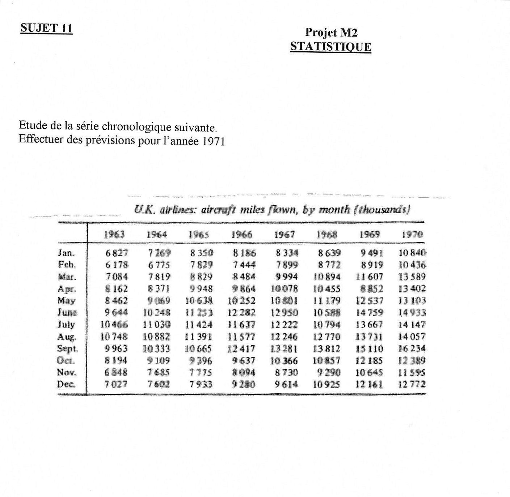

```{r eval=FALSE, include=FALSE}
#install.packages("sjPlot")
#install.packages("visreg")

library(visreg)
# https://cran.r-project.org/web//packages/visreg/visreg.pdf
library(sjPlot)
# https://strengejacke.github.io/sjPlot/articles/tab_model_estimates.html
library(directlabels)
# https://tdhock.github.io/directlabels/

library(knitr)
library(tidyverse)
library(stargazer)

## https://towardsdatascience.com/statistical-test-for-time-series-a57d9155d09b
```


```{r setup, include=FALSE}
knitr::opts_chunk$set(echo = FALSE)
library(latex2exp)
library(stargazer)
library(dplyr)
library(astsa)
library(changepoint)
#library(caschrono) -> pas possible, dépendance de r-foreign -> R 3.6
library(tseries)
library(forecast)
library(lmtest)

wd <- "/home/matthias/Documents/Wien/Statistik/Erasmus/cours/serieschrono/projet/"
setwd(wd)
```

## Les bases

Dans ce projet il faut effectuer une analyse des données reçues, et faire une prévision pour l'année 1971.
Nous allons utiliser R avec les packages `tseries` et `astsa`.

Premièrement, il suit une analyse rudimentaire des données et de leurs propriétés.


```{r import, include=FALSE}
donnees <- read.csv("donnees.csv", stringsAsFactors=FALSE)
donnees$date = as.Date(donnees$date, "%d/%m/%Y")
miles = ts(donnees$miles, 
           start=as.double(format.Date(donnees$date[1], "%Y")), 
           frequency=12)
```
Les données sont affichées ci-dessous. C'est bien évident qu'il ne s'agit pas d'une séries stationnaire, car il y a une tendance.
Denommons les miles par mois avec la suite $(X_t)$.
```{r representation graphique de la serie temporelle}
plot(donnees, type="l", main = "U.K. airlines: aircraft miles flown, by months (thousands)")
#plot(donnees$date, log(donnees$miles), type = "l")
```

En fait on voit que les données sont stationnaires? Comment est-ce possible : 
```{r}
adf.test(donnees$miles, alternative = "stationary")
```

Mais il semble aussi qu'il ait une croissance exponentielle. Cela ne surprend pas avec une scale non-négative.
Pour comparison: La variance de la première moitié est $`r round(var(head(miles,length(miles)/2)), -5)`$, la seconde moitié $`r round(var(tail(miles,length(miles)/2)), -5)`$.
Afin de reducer cette propriété nous prenons le logarithme népérien (variances: $`r round(var(head(log(miles),length(miles)/2)), 3)`$ et $`r round(var(tail(log(miles),length(miles)/2)), 3)`$).

```{r}
plot(donnees$date, log(miles), type= "l",
     xlab = "date",
     ylab = TeX("$\\log(X_t)$"),
     main = TeX("$\\log(X_t)$"))
```


```{r}
dw = dwtest(log(miles) ~ date, 
            data = donnees)$p.value
```
On a fait un Durbin-Watson Test: $H_0$ afin de savoir si l'autocorrelation des erreurs estimées d'un modèle linéare `log(miles) ~ date` est égal à 0, qui est rejetée avec une valeur p de $`r round(dw, 3)`$. 
Clairement on rejète $H_0$.
Il y aura sûrement des autres assumptions blessées pour faire un GLM, par exemple l'égalité des variances et l'indépandence des valeurs et des erreurs.

### La tendance

En gros, on a deux possibilités pour supprimer la tendance.
Soit avec un modèl additif:

```{r eval=FALSE, include=FALSE}
#m = decompose(log(miles), type = "additive")
#plot(m)
# plot(decompose(miles, type = "multiplicative")) -> I think multiplicative is more fitting, as the lag and seasonality for the non-log at least are increasing with time
```
```{r tendance linéare additive}
fit.add = lm(log(miles) ~ date, data = donnees)

par(mfrow=c(1,2))
plot(donnees$date, log(miles), 
     ylab = TeX("$\\log(X_t)$"),
     xlab = "date",
     type = "l")
abline(fit.add, col = "red")
legend(legend="regression",
       x=-2,y=8.85,xjust=1,bty="n",
       fill = "red")

plot(fit.add$residuals,
     xlab = "date",
     type = "l")
```

Soit en différencier:
$$log(X_t) - log(X_{t-1}) = (1-B)\log(X_t)$$
```{r delta}
mdiff1 = diff(log(miles), lag = 1, difference = 1) #12
# difference to the first order

fit.mult = lm(mdiff1 ~ x)

par(mfrow=c(1,2))
plot(tail(donnees$date, length(mdiff1)), 
     mdiff1, type = "l",
     ylab = TeX("$(1-B)\\log(X_t)$"),
     xlab = "date")
abline(fit.mult, col = "red")
plot(fit.mult$residuals, 
     xlab = "date",
     type = "l")
```
Il ne reste pas une tendence. Ci-dessous on voit que il n'y a ni une tendance ni une moyenne qui n'est pas zéro. 
```{r}
summary(fit.mult)$coefficients
```
Laquelle mèthode choisir ? Généralment différencier est mieux.

La séries est-elle stationnaire ? Non, il y a encore la saisonalité.
```{r eval=FALSE, include=FALSE}
# Est-ce que cela peut aider à decider entre le modèle additif et multiplicatif ?

par(mfcol=c(2,2),mar=c(2,4,1,5),pch=20)

acf(fit.add$residuals); mtext("  add.",3,las=1)
pacf(fit.add$residuals)
acf(fit.mult$residuals); mtext("  mult.",3,las=1)
pacf(fit.mult$residuals)
```


### Saisonnalité

On introduit une componente saisonnal dans le modèl proposé.

$$(1-B)(1-B^{12}) \log(X_t) $$
```{r test pour station.}
mdiff12diff1 = diff(mdiff1, lag=12, differences=1)
#tsdisplay(mdiff12diff1, ci.type = "ma", main = "(1-B)(1-B^12)X_t")
plot(tail(donnees$date, length(mdiff12diff1)), 
     mdiff12diff1, 
     type = "l",
     ylab = TeX("$(1-B)(1-B^{12}) \\log(X_t)$"),
     xlab = "date")
abline(h=0, col = "grey")
```


Pour tester si la série est stationnaire nous utilisons l'Augmented Dickey-Fuller t-statistic test. 
ADF test is a test to check whether the series has a unit root or not. If it exists, the series has a linear trend. However, if it’s not, we can say that the model is stationary.
```{r}
adf.test(mdiff12diff1)
```
Peut-on déjà poser que $(1-B)(1-B^{12}) \log(X_t) = \varepsilon_t$, avec $\varepsilon_t$ un bruit blanc ?

```{r}
acf(mdiff1, lag.max = 50, ci.type = "ma")
# acf(log(miles), lag.max = 80)
```

Ici on peut éxpliquer qu'est-ce que c'est, l'ACF.
Ils sortent beaucoup de bâtons, significatif à 3, 4, 5, 7, 12 et 24 mois.
D'ailleurs il y une décroissement lente, cela peut indiquer qu'on faut encore differencier.

```{r}
plot(mdiff12diff1)
fit.12.1 <- lm(mdiff12diff1 ~ tail(donnees$date,83))
abline(fit.12.1, col="red")
# summary(fit.12.1)
```
Dans l'ACF il y a encore quelques bâtons qui sortent: à 1, 2 et 12 mois, sans qu'on puisse détérminer une règle.
Mais il n'y a aucune repère qu'il faut un modèl multiplicatif (des bâtons qui sortent encadré par des bâtons de signe inversée).

En ce qui concerne les auto-corrélations partielles, il y a égalements des fréquences significatives pour un décalage de 1,2,4, 10, 11 et 12 mois, et cela ne se abbaisse pas avec un lag plus grand semble-t-il.
Cela indique qu'il faut un modèle MA !


Les $\varepsilon$ pour les deux modèls semblent stationnaire:

```{r delta 2.0}
adf.test(fit.mult$residuals, k=1)
adf.test(fit.mult$residuals, k=2)
adf.test(fit.mult$residuals, k=3)
adf.test(fit.mult$residuals, k=4)


adf.test(fit.add$residuals, k=1)
adf.test(fit.add$residuals, k=2)
adf.test(fit.add$residuals, k=3)
adf.test(fit.add$residuals, k=4)
```

### Modèliser

Après differencier il faut tester s'il reste qu'un bruit blanc.
On peut utiliser un Box-Test.

```{r fitting a model}
model1 <- arima(miles, order = c(0,1,1), seasonal=list(order = c(0,1,1), perdiod=12))

summary(model1)
```

### densité spectrale

##### Fréquences

Pour le moment je sais pas trop comment expliquer / utiliser.

```{r periodogramm}
periodogramm <- function(z){
  
# Abbildung 3
par(mfcol=c(3,1),mar=c(2,2,0.5,2),pch=20)
h <- 2*pi
H <- spec.pgram(z, taper=0,detrend=FALSE,fast=FALSE,plot=FALSE)
plot(h*H$freq,H$spec/h,type="l")
mtext(" (a)",4,las=1)

# tendance
t = tail(donnees$date,length(z))
H <- spec.pgram(lm(z ~ t)$residuals,taper=0,detrend=FALSE,fast=FALSE,plot=FALSE)
plot(h*H$freq,H$spec/h,type="l")
mtext(" (c)",4,las=1)

plot(log(h*H$freq[1:20]),log(H$spec[1:20]/h),type="o",lwd=2)  
mtext(" (e)",4,las=1) 

for (c in (-15):(15)) abline(a=c,b=-1,col="gray")
}

#periodogramm(mdiff12diff1)
periodogramm(fit.add$residuals)
periodogramm(miles)
```


C'est déja mieux, les erreurs semblent plus stable, mais pourtant il existe une autocorrélation.

```{r}
periodogramm(mdiff1)
```

Pour les données différenciées il n'y a pas une courbe raide vers le zéro (voir a, fréquence de Fourier $\omega_k = \frac{2\pi k}{n}$)).
En outre, le log-périodogrammes des résidus tombe moins vite pour les résidus des données différenciées (voir e) qu'implique des résidues stationnairs.

Steigt die Spektraldichte $f(\omega)$ mindestens so steil an wie $h(\omega ) = c\omega^{-1}$ , dann ist sie nicht integrierbar, was unvereinbar ist mit Stationarität, weil die Varianz eines stationären Prozesses gegeben ist durch das Integral der Spektraldichte. In der Praxis ist $f$ unbekannt und muss durch einen Proxy ersetzt werden, z.B. durch das Periodogramm $I$. Für eine graphische Einschätzung der Stationarität kann man $I(\omega)$ gegen $\omega$ plotten und mit $h(\omega ) = c\omega^{-1}$ vergleichen. Einfacher ist es aber, wenn man $\log(I(\omega))$ gegen $\log(\omega)$ plottet und mit Geraden der Steigung -1 vergleicht (siehe Abbildung 3).

```{r forecast}
fvalues <- forecast(model1, 12)
# = fvalues2 <- predict(model1, 12)
print(fvalues)
plot(fvalues, col.main = "red")
```

```{r model diagnostics}
tsdiag(model1)

# il manque un t-test ? Donc:
coeftest(model1) #https://stackoverflow.com/questions/43826952/how-can-i-get-the-t-statistics-for-the-results-of-an-ar1-model-in-r

# portmanteau tests
Box.test(mdiff12diff1)
Box.test(residuals(model1), type = "Ljung-Box")


acf(residuals(model1), ci.type="ma")
pacf(residuals(model1), ci.type="ma" ,main="corrélogramme partiel de residuals(model1)")
```

### Base de test

Pour comparer les modèles qu'on a choisi pour faire la prévision, on sépare la dernière année, 1970, calcule les estimateurs pour les modèles et fait des prévision.
La meilleure prévision détermine la modèle laquelle on va choisir finalement.
Pour comparer la qualité des prévision on peut utiliser le MSE (mean squared error) et leurs AIC.

```{r}
# L'année 1970
test =  tail(miles, 12)
# Les années 1963-1969
train = head(miles, length(miles)-12)

# Puis MSE?
```

```{r}

# Arima # {forecast} <-> comparer avec astsa?
# https://developpaper.com/arma-arima-box-jenkins-sarima-and-arimax-models-in-r-language-are-used-to-predict-time-series-data/

# library: {astsa}

test = sarima(log(miles), 
              p= 0, d= 1, q= 0, P= 0, D= 0, Q= 0, S= 12,
              details = T) # => Plot et Diagnostics

# Values: fit, AIC, BIC, ttable

#sarima.for #=> pour la prévision
```


```{r eval=FALSE, include=FALSE}
#d'une vidéo Youtube
# pour afficher avec les intervalles de confiance

plot(Z)
lines(mydata.pred$pred)
lines(mydata.pred$se + 2* mydata.pred$se)
lines(mydata.pred$se - 2* mydata.pred$se)

```

